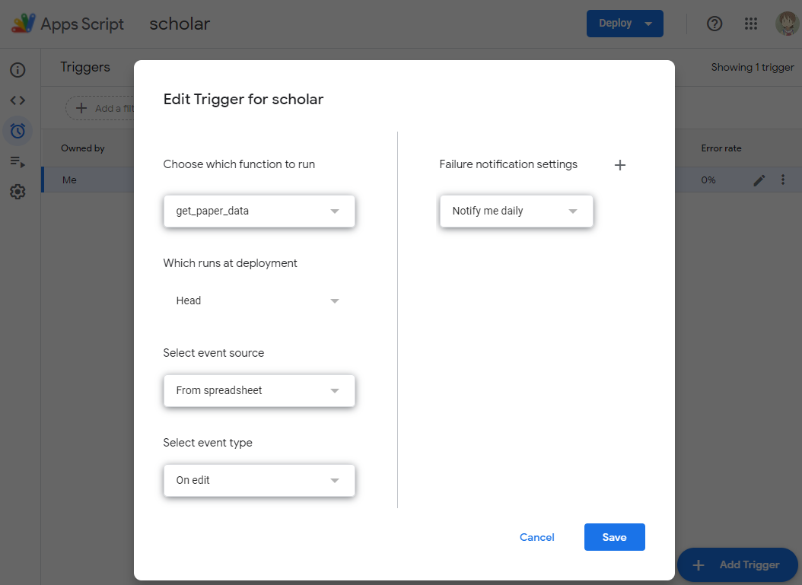
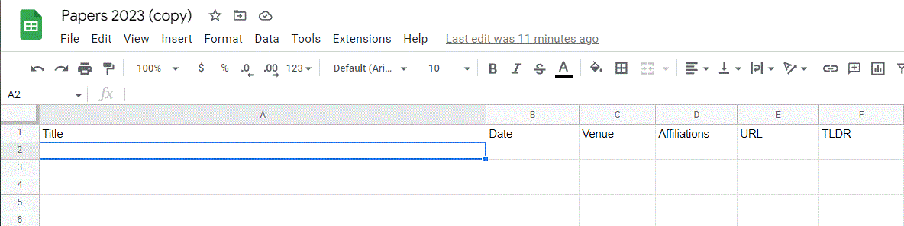

# Spreadsheet Paper List Script
Traditional paper management softwares like Zotero/Mendeley usually don't support flexible customization. Google spreadsheet makes it possible to create a paper list in the style you like. This script calls API from semantic scholar and complete the meta-information of the paper itself.

## How to use
1. Copy the script to `Apps Script` from the spreadsheet menu

2. Create a "On edit" trigger to `get_paper_data`

   

3. Now you can input any paper titles in the first column and other information will pop up automatically! (Date, Venue, Affiliations, URL, TLDR)

3. It's easy to extend this script with any functions you want to have in your paper list.

## Example

